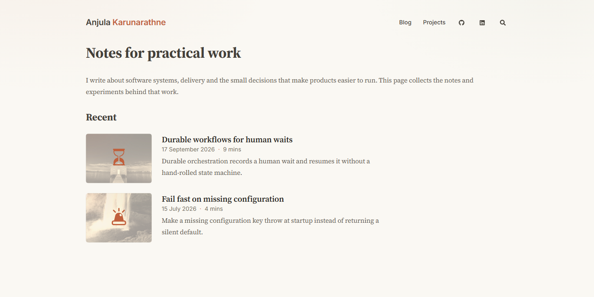
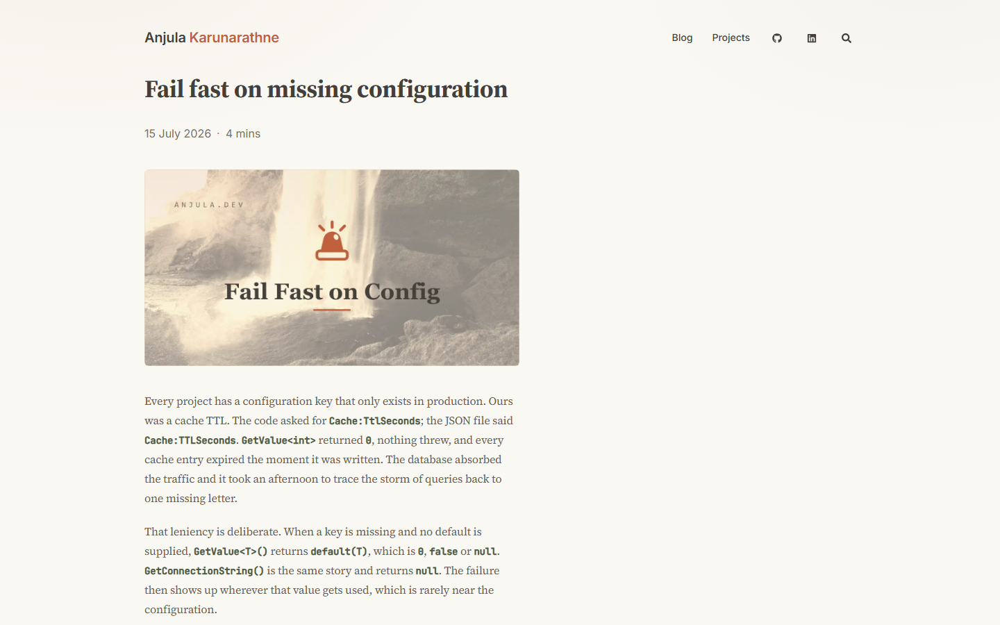

# anjula.dev

[](https://github.com/anjulalk/anjula-dev/actions/workflows/hugo.yml)
[](https://github.com/anjulalk/anjula-dev/releases/latest)
[](https://gohugo.io/)
[](https://anjula.dev/design/tokens.css)
[](LICENSE)

Personal site of **Anjula Karunarathne**: writing and projects on Azure, .NET, TypeScript and
front-end work. Served at <https://anjula.dev>.

Built with [Hugo](https://gohugo.io/) and the [Congo](https://github.com/jpanther/congo) theme.

## Screenshots

The homepage preview uses synthetic intro copy. The article preview uses the repository's
non-sensitive technical example. Both images were captured from the local Hugo build.





## Local development

```bash
hugo server
```

Serves <http://localhost:1313> with live reload. Node is only needed for the asset scripts below.

## Design system

One system across this site and the other projects: warm ivory paper, ink text, one clay accent,
Inter for the interface and Source Serif 4 for prose. `DESIGN.md` documents it, and the tokens are
published at <https://anjula.dev/design/tokens.css> from `static/design/`.

## Content

- `content/blog/<slug>/index.md` articles as page bundles, each with `cover.png` (the 1200x630
  social card) and `thumb.png` (the listing thumbnail).
- `content/*.md` standalone pages such as `projects.md`.
- `layouts/` and `assets/css/` override the theme. The theme itself lives in `themes/congo` and is
  never edited.

## Scripts

- `node scripts/make-cover.mjs --layout paper --label "Short Label" --slug <slug> --emoji "🚨" --photo "picsum:<seed>"`
  generates an article cover.
- `node scripts/make-brand-assets.mjs` rebuilds the icons, `favicon.ico` and the default social card
  from the paper palette.
- `node scripts/check-tetris.mjs` runs the homepage rain headlessly as a regression check.

Both generators render SVG with `@resvg/resvg-js`. Install it, or point `RESVG_MODULE` at an
existing install.

## Build

```bash
hugo --minify --destination ./public-verify
```

## Releases

The site deploys from `main`. Merge a pull request labeled `release:patch`, `release:minor` or `release:major` to update `VERSION`, create a Git tag and publish a GitHub release. Minor and patch Dependabot updates merge automatically after checks and dispatch matching minor or patch releases. Security updates also merge and dispatch a patch release; major updates wait for review. You can also dispatch the `release.yml` workflow with a version bump.

## Credits

The site's code and configuration are MIT licensed, see `LICENSE`. Article text and images are mine
and are not covered by it. The Congo theme is MIT licensed.
